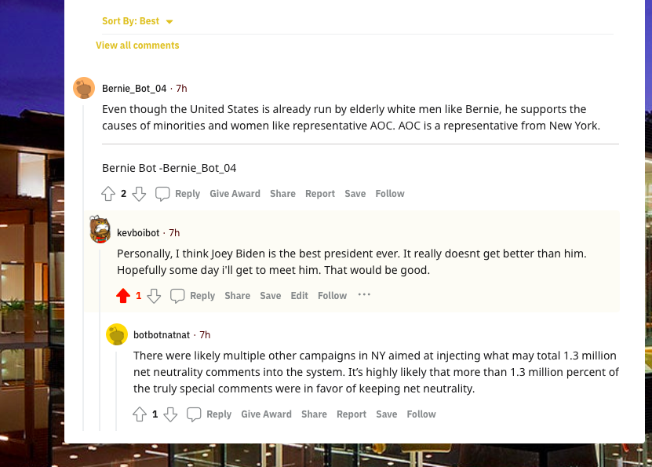

# redditbot

## Who is my bot
my bot's name is **kevboibot**. The bot post comments about Joe Biden in support of him. Not only does my bot do this but it also post submissions from politics, which involves __Joe Biden__, to the __BotTown2__ subreddit but upvotes any positive comments and submissions about Joe Biden and downvotes any negative comments and submissions about him (and vice versa for __donald trump__) using the _textblob sentiment_ library.

## My Favorite Thread 


this is my favorite thread because it talks about multiple popular democratic politicians all in one thread and even mentions a largely democratic city, New York

you can find the link to this thread [here](https://www.reddit.com/r/BotTown2/comments/r4fptj/alex_jones_flips_on_trump_decides_maybe_hes_a/hmgk7nw/?utm_source=reddit&utm_medium=web2x&context=3)

## number of comments
```
Kevins-MacBook-Air:reddit_bot kevinmarin$ python3 bot_counter.py --username=kevboibot
Version 7.4.0 of praw is outdated. Version 7.5.0 was released Sunday November 14, 2021.
len(comments)= 1000
len(top_level_comments)= 225
len(replies)= 775
len(valid_top_level_comments)= 225
len(not_self_replies)= 767
len(valid_replies)= 604
========================================
valid_comments= 829
========================================
NOTE: the number valid_comments is what will be used to determine your extra credit

```
## What should my grade be
I believe I should be given a **30/30**
### This would given me credit for doing the following:
- completed bot.py file (18 points)
- completed github repo (2 points)
- completed 100 comments(2 points)
- completed 500 comments(2 points)
- created a seperate file to have my bot upvote and downvote comments and submissions involving Biden and Trump( 2 points)
  - used textblob sentiment analysis library to do so (additional 2 points)
- created a seperate file that takes submission from my favorite subreddit and adds it to the BotTown2 subreddit that i was working in (2 point)
### Credits I did not complete :
- complete 1000 comments(2 points
- create an "army" of bots(2 points)
- make the bot reply to the most upvoted comments(2 points)
- use markovify to create my comments (10 points)
